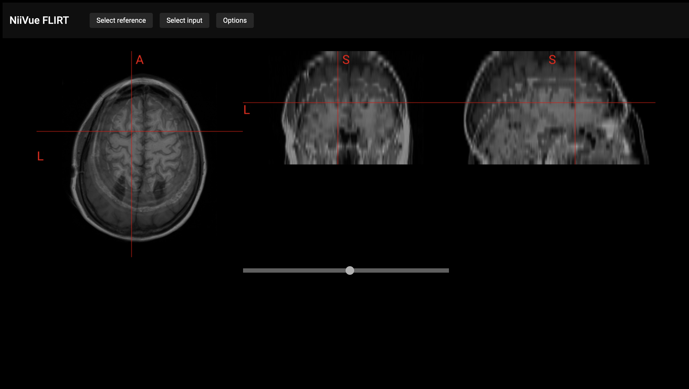
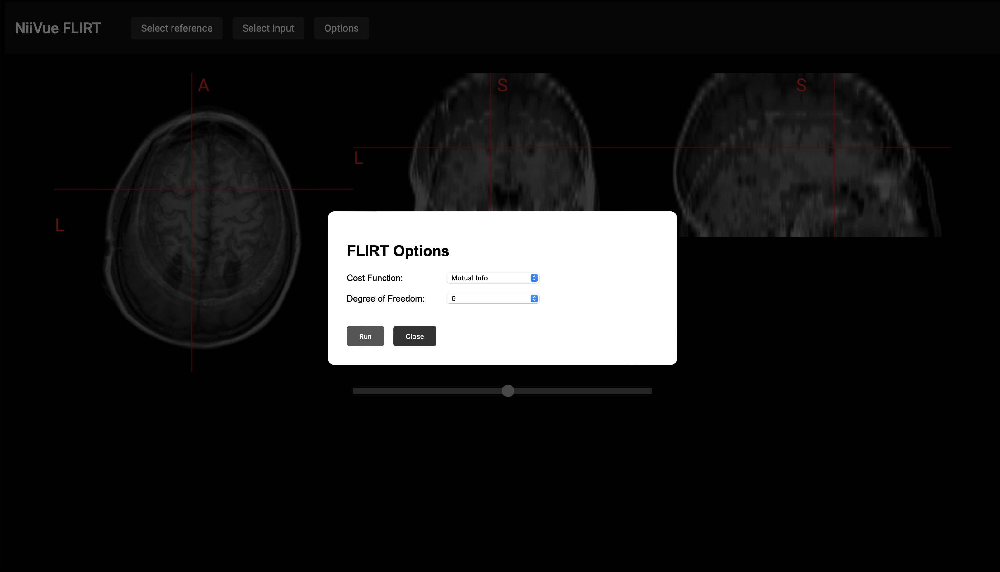
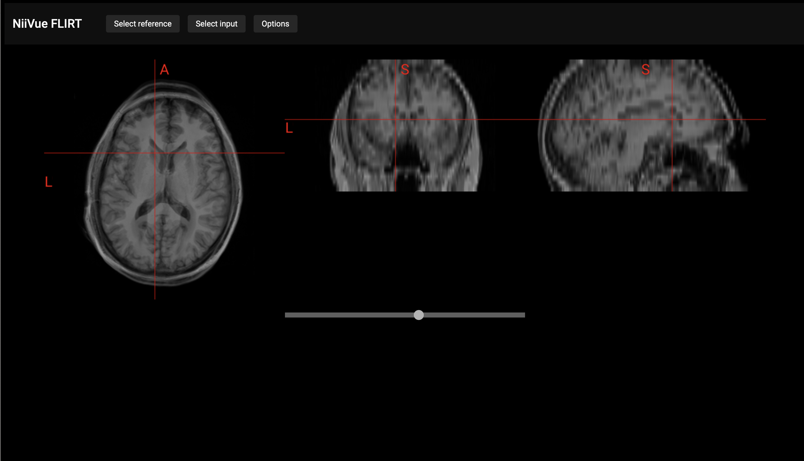

# NiiVue + FLIRT

Integration of the [WASM port](https://github.com/wpmed92/WebMRI) of FSL [FLIRT](https://fsl.fmrib.ox.ac.uk/fsl/fslwiki/FLIRT) into [NiiVue](https://github.com/niivue/niivue)

## Build

This examples uses [Vite](https://vitejs.dev) 
To run:
`npm run dev`

## Usage

Try the demo [here](https://softwiredtech.github.io/niivue-flirt/)! 

To run FLIRT, first select a reference and an input volume. Click on "Options" to change the cost function and the degree of freedom values, then click "Run" to perform the registration.

You can use the slider below the canvas to blend the refrence volume (left-most position)
 with the input volume (right-most position).

## License

BSD 2-Clause License
